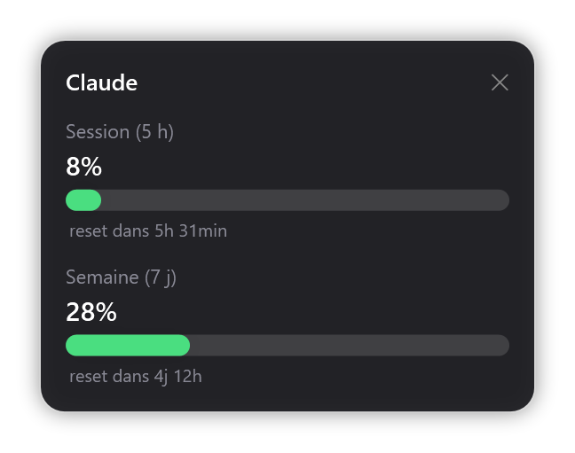

# Widget Claude v1.3

Widget de bureau pour Windows 11 qui affiche **en direct ta consommation Claude** : la fenêtre de session (5 h) et le quota hebdomadaire (7 jours), avec le temps restant avant chaque reset.

Les données sont lues via la session **Claude Code** déjà présente sur le PC (API OAuth de consommation). Aucun mot de passe ni jeton n'est stocké par le widget : il réutilise uniquement les identifiants existants de Claude Code.

---

## Aperçu

  

Affichage :

| Mode | Fichier | Description |
|------|---------|-------------|
| **Flottant** | `ClaudeWidget.exe` | Petit panneau posé sur le bureau, déplaçable au clic-glissé (position mémorisée). |

Barres de couleur : 🟢 vert < 50 %, 🟠 ambre 50–85 %, 🔴 rouge > 85 %.
Les données se rafraîchissent automatiquement toutes les 2 minutes.

---

## 🚀 Nouveautés v1.42

- **Raccourci Global** : Appuyez sur `Ctrl + Maj + C` de n'importe où pour cacher ou afficher le widget flottant instantanément !
- **Notifications & Son** : Recevez une bulle de notification Windows et un son (`tada.wav`) quand vos tokens de session sont restaurés.
- **Thèmes & Personnalisation** : Clic-droit pour changer de thème ! 
  - *Normal* (gris classique)
  - *Rainbow* (dégradé arc-en-ciel + **Nyan Cat animé** et sa **musique en boucle**)
  - *Nintendo 64* (fond gris clair, barre 4 couleurs N64)
  - *Gamecube* (fond Indigo, barre orange)
  - *DJ* (Rose Playboy, visage ( ๏ )( ๏ ) qui se dandine avec un « Boing Boing »)
  - *888* (palette maussade, visage 8=D dont la langue s'allonge avec la conso)
- **Musique des thèmes** : la musique Nyan Cat se lance sur le thème Rainbow ; désactivable via le clic-droit (« Activer la musique des thèmes »).
- **Mode Fantôme** : Rend le widget flottant semi-transparent (50%) pour ne pas gêner votre code.
- **Mascottes animées** : un Pikachu (thèmes classiques) ou un Nyan Cat (Rainbow) court le long de votre barre de session.
- **Historique** : Génère un journal d'utilisation `ClaudeHistory.log` pour suivre l'heure exacte de vos limites et renouvellements.

---

## Prérequis

Sur chaque PC où tu veux utiliser le widget :

1. **Claude Code** installé.
2. Être **connecté à ton compte Claude**. Si tu as déjà connecté Claude Code dans ton terminal (PowerShell ou Git Bash), c'est bon — pas besoin de refaire `/login`. Sinon, lance `claude` une première fois et fais `/login`.

Le widget lit le fichier de session `~/.claude/.credentials.json` et rafraîchit le jeton OAuth automatiquement quand il expire. Il n'écrit jamais de secret ailleurs.

---

## Utilisation rapide

Le plus simple — double-clique sur **`ClaudeWidget.exe`** (fichier unique, icône et Pikachu intégrés).

> Au tout premier lancement, Windows SmartScreen peut afficher « Windows a protégé votre PC » car l'exécutable n'est pas signé.
> Clique **Informations complémentaires** → **Exécuter quand même** (une seule fois par PC).

- **Déplacer** le widget : clique-glisse dessus.
- **Fermer** le widget : la croix ✕ en haut à droite, ou via l'icône de la barre des tâches.

---

## Lancement automatique au démarrage

1. Copie d'abord le dossier sur le **disque du PC** (par ex. dans `Documents`) — pas depuis une clé USB, sinon le widget ne se lancera que si la clé est branchée.
2. Lance `powershell -ExecutionPolicy Bypass -File Installer-Demarrage.ps1` (le widget flottant se lancera à l'ouverture de session).

Pour désactiver : `powershell -ExecutionPolicy Bypass -File Installer-Demarrage.ps1 -Remove` (ou supprime le raccourci « Claude Usage Widget.lnk » dans `shell:startup`).

---

## Contenu du dépôt

| Fichier | Rôle |
|---------|------|
| `ClaudeWidget.exe` | Le widget flottant, fichier unique 100 % autonome (Pikachu, Nyan Cat et musique intégrés). |
| `ClaudeUsageWidget.ps1` | Code du widget flottant (WPF / PowerShell). |
| `ClaudeWidget.vbs` | Lanceur silencieux du script. |
| `Installer-Demarrage.ps1` | Active / désactive le lancement au démarrage. |
| `pikachu-cours-dark.gif` / `nyan-cat.gif` | Sprites animés (sources ; déjà intégrés dans `ClaudeWidget.exe`). |
| `Build-Icon.ps1` | Génère `claude.ico`. |
| `claude.ico` | Icône du widget. |
| `tools/` | Source de la musique Nyan Cat (`.mid`) et script de rendu chiptune (`render-nyan.py`). |
| `archives/` | Ancien widget « zone de notification » (`ClaudeTrayWidget`), plus maintenu. |

---

## Fonctionnement technique

- `Get-Creds` lit `~/.claude/.credentials.json` ; `Get-Token` / `Refresh-Token` gèrent le jeton OAuth (`client_id` public de Claude Code, `grant_type=refresh_token`).
- La consommation est récupérée sur `https://api.anthropic.com/api/oauth/usage` (en-tête `anthropic-beta: oauth-2025-04-20`), champs `five_hour.utilization` et `seven_day.utilization`.
- L'interface est en **WPF** (PowerShell).

---

## Licence

Voir le fichier [LICENSE](LICENSE).
